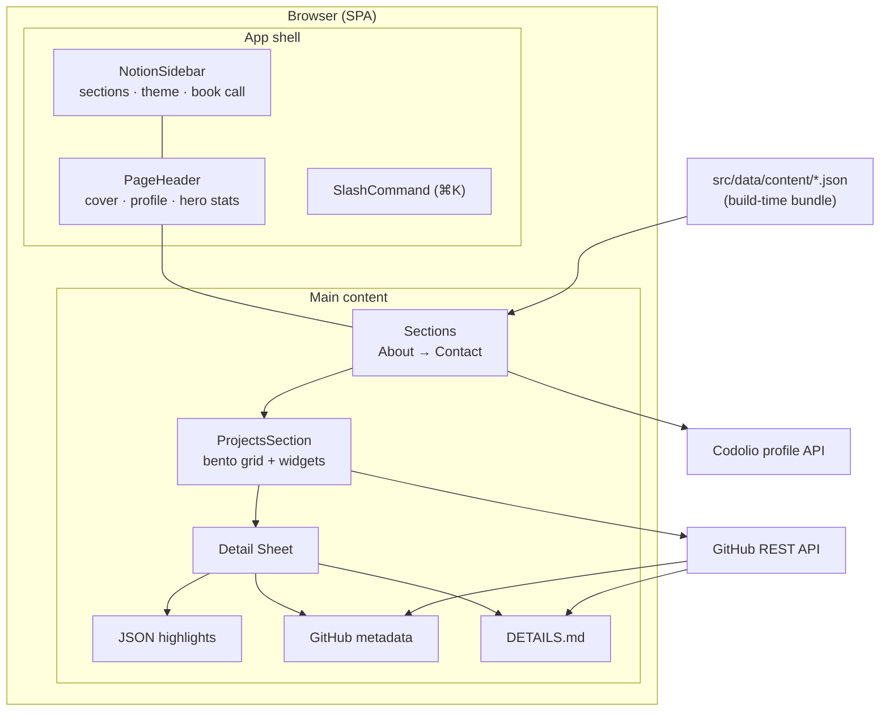

# Notion Portfolio — Project Details

A single-page developer portfolio that mimics Notion’s workspace UX: sidebar navigation, block-style sections, property tables, and slide-over detail sheets. All static content is authored as typed JSON; two live integrations enrich the experience at runtime.

## Overview

The app is a client-only React SPA — no backend server. Vite bundles the site; content ships with the build. Users browse sections via the sidebar or `⌘K` slash command, open project detail sheets, and view live stats where APIs allow.

| Area               | What it does                                                                        |
| ------------------ | ----------------------------------------------------------------------------------- |
| **Layout**         | Fixed Notion-style sidebar, cover banner header, scrollable main column (max 900px) |
| **Projects**       | Bento grid with mixed tile sizes, portfolio widgets, GitHub-powered detail sheets   |
| **Experience**     | Timeline + table views                                                              |
| **Education**      | Gantt chart + table                                                                 |
| **Certifications** | Kanban board (To do / In progress / Done)                                           |
| **Coding**         | Live Codolio stats, problems donut, topic breakdown charts                          |
| **Contact**        | Links + Cal.com embed for booking calls                                             |

---

## Architecture



### Data flow

1. **Static content** — JSON files under `src/data/content/` are imported in `src/data/index.ts`, typed via `src/types/portfolio.ts`, and passed to section components.
2. **GitHub project sheets** — When a project card opens, `useGithubProject` calls `fetchGithubProjectData()` in parallel for:
   - `DETAILS.md` (raw markdown from repo root)
   - Repo metadata (stars, forks, topics, license, dates, size)
   - Language breakdown, latest release, top contributors
3. **Codolio CP stats** — `useCodolioStats` fetches the Codolio profile API at runtime; on failure it falls back to `codolio-snapshot.json` (refreshed via `npm run sync:codolio`).

Results are cached in-memory for the session to avoid duplicate API calls.

---

## Projects section

### Bento grid

The layout is defined in `BENTO_LAYOUT` inside `ProjectsSection.tsx` — an ordered list of project IDs and inline widgets (`stats`, `building`).

| Tile size         | Grid span      | Card behavior                                |
| ----------------- | -------------- | -------------------------------------------- |
| **1×1** (`small`) | 1 col × 1 row  | 1 highlight bullet, stack clamped to 2 lines |
| **2×1** (`wide`)  | 2 cols × 1 row | 2 highlight bullets, 2-line clamp            |
| **1×2** (`tall`)  | 1 col × 2 rows | 2 highlight bullets, full text (no clamp)    |

Each card shows: icon, name, tagline, featured star, GitHub/demo links (top-right), up to 5 stack tags (sorted by global frequency across all projects).

### Detail sheet (on card click)

Rendered inside a Radix `Sheet` slide-over:

1. **Header** — project name + tagline
2. **Property table** — period, status, GitHub stats (stars, forks, size, visibility, created/updated, contributors, topics, license, latest release)
3. **Stack & languages** — JSON stack tags + GitHub language bar chart
4. **Highlights** — bullet list from `projects.json`
5. **Details** — this file (`DETAILS.md`), rendered with `react-markdown` + `remark-gfm`; falls back to optional `architecture` field in JSON if the file is missing

---

## Live integrations

### GitHub API

| Endpoint                                        | Purpose                    |
| ----------------------------------------------- | -------------------------- |
| `GET /repos/{owner}/{repo}/contents/DETAILS.md` | Project deep-dive markdown |
| `GET /repos/{owner}/{repo}`                     | Core repo metadata         |
| `GET /repos/{owner}/{repo}/languages`           | Language byte breakdown    |
| `GET /repos/{owner}/{repo}/releases/latest`     | Latest release tag         |
| `GET /repos/{owner}/{repo}/contributors`        | Top contributors           |

Optional `VITE_GITHUB_TOKEN` in `.env` raises the rate limit from 60 → 5,000 requests/hour.

### Codolio API

Fetches coding stats for LeetCode, GeeksforGeeks, and InterviewBit handles defined in `achievements.json`. Normalizes:

- Current / max rating and rank
- Total problems solved per platform
- Topic-wise distribution (Codeforces topics from `dailyActivityStatsResponse`)

Static fallbacks exist for platforms without live API support (foolcoder, pir0_coder).

---

## Content model

All editable portfolio data lives in `src/data/content/`:

| File                    | Contents                                                                         |
| ----------------------- | -------------------------------------------------------------------------------- |
| `profile.json`          | Name, title, summary, property pills                                             |
| `site.json`             | Workspace name, social links, Cal.com URL, CV link                               |
| `sections.json`         | Sidebar order, icons, visibility flags                                           |
| `experience.json`       | Work history entries                                                             |
| `education.json`        | Degrees with timeline dates                                                      |
| `projects.json`         | Projects: stack, links, bento size, highlights, optional `architecture` fallback |
| `skills.json`           | Grouped skill lists                                                              |
| `certifications.json`   | Kanban certification cards                                                       |
| `achievements.json`     | CP platform handles, static ranks, chart config                                  |
| `contact.json`          | Contact method links                                                             |
| `hero-stats.json`       | Stat pills under the page header                                                 |
| `codolio-snapshot.json` | Build-time CP snapshot (generated)                                               |

Types are centralized in `src/types/portfolio.ts`.

---

## Source layout

```
src/
├── components/
│   ├── notion/           # Sidebar, blocks, property table, slash command
│   ├── sections/         # Page sections (Projects, Experience, CP, …)
│   ├── projects/         # GitHub detail body, markdown renderer, language bars
│   ├── ui/               # shadcn primitives (sheet, badge, button, …)
│   ├── booking/          # Cal.com embed
│   ├── cursor/           # Custom cursor hint provider
│   └── theme-provider.tsx
├── data/
│   ├── content/          # Portfolio JSON (source of truth)
│   └── index.ts          # Barrel export + derived stats
├── hooks/
│   ├── useGithubProject.ts
│   └── useCodolioStats.ts
├── lib/
│   ├── github.ts         # GitHub API client + caching
│   ├── codolio.ts        # Codolio fetch + normalization
│   └── utils.ts
└── types/
    └── portfolio.ts      # Shared TypeScript interfaces
```

## Design decisions

- **JSON over CMS** — zero hosting cost, full type safety, version-controlled content, no API keys for content edits.
- **`DETAILS.md` over README** — README stays repo-focused; `DETAILS.md` carries portfolio-specific deep dives without polluting GitHub’s default view.
- **Client-side API calls** — keeps deployment simple (static hosting on Vercel/Netlify/GitHub Pages); trade-off is exposed token in env var (mitigated by read-only PAT scoped to public repos).
- **Codolio snapshot fallback** — CP section stays populated even when the live API is down or rate-limited.
- **Bento-only projects view** — table view removed; bento grid is the primary visual showcase.

---

## Current project roster

| Project               | Tile     | Featured |
| --------------------- | -------- | -------- |
| coldMail              | 2×1 wide | ✓        |
| Notion Portfolio      | 2×1 wide | ✓        |
| GameVault             | 1×2 tall | ✓        |
| PriceTrackEr          | 2×1 wide | ✓        |
| Sports Centre Booking | 2×1 wide |          |
| File Organizer        | 1×2 tall |          |
| Image → LaTeX         | 2×1 wide |          |

Plus inline widgets: **Portfolio stats** (project count, featured count) and **Currently building** (in-progress projects with demo links).
